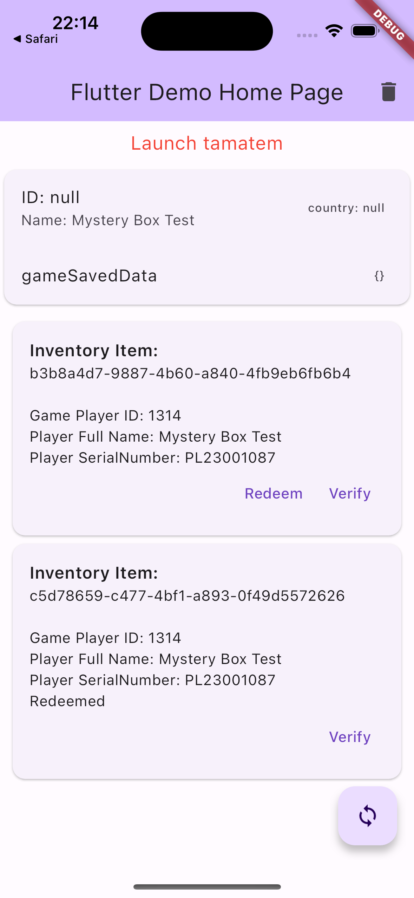

# flutter_tamatem_plus

A flutter project that RESTful integrates Tamatem Plus.

## Getting Started


Tamatem Plus's online document:

https://developers.tamatemplus.com/



### Start the project

1. Add ".env" file in the root Project:

```
TAMATEM_DOMAIN={TAMATEM_DOMAIN}
TAMATEM_CLIENT_ID={TAMATEM_CLIENT_ID}
TAMATEM_CUSTOM_SCHEME={TAMATEM_CUSTOM_SCHEME}
TAMATEM_GAME_STORE={TAMATEM_GAME_STORE}
```

2. start the project
```
flutter run
```